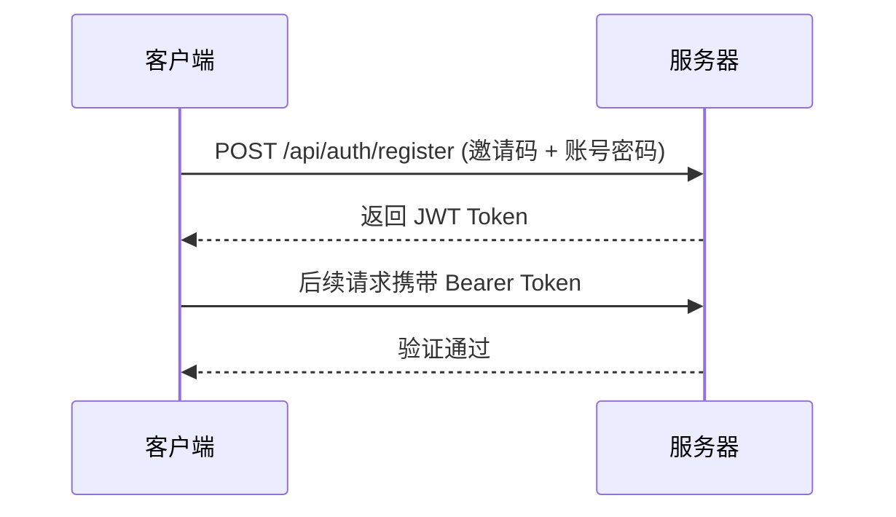
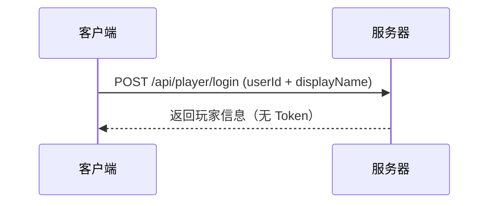
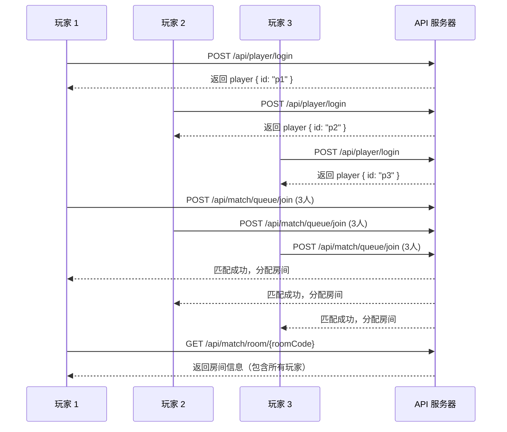

# 黑暗森林 API 文档

本文档提供黑暗森林游戏 API 的完整接口说明，供客户端开发者参考。

## 📖 文档结构

| 文件 | 说明 |
|------|------|
| [`openapi.yaml`](./openapi.yaml) | OpenAPI 3.0 规范文件，可用于 Swagger UI、代码生成等 |
| [`API-README.md`](./API-README.md) | 本文档，提供快速上手指南和接口概览 |

## 🚀 快速开始

### 1. 查看交互式 API 文档

您可以使用 Swagger UI 查看交互式文档：

```bash
# 方法一：使用 Swagger Editor（在线）
# 访问 https://editor.swagger.io/ 并粘贴 openapi.yaml 内容

# 方法二：本地运行 Swagger UI
npx swagger-ui-watcher openapi.yaml

# 方法三：使用 Redoc
npx redoc-cli serve openapi.yaml
```

### 2. 生成客户端代码

使用 OpenAPI Generator 可自动生成多种语言的客户端代码：

```bash
# 生成 TypeScript 客户端
npx @openapitools/openapi-generator-cli generate \
  -i openapi.yaml \
  -g typescript-axios \
  -o ./generated-client

# 生成 Python 客户端
npx @openapitools/openapi-generator-cli generate \
  -i openapi.yaml \
  -g python \
  -o ./generated-client-python
```

## 🔐 认证方式

项目提供两种认证模式：

### 模式一：正式认证（推荐生产环境）



**使用流程：**
1. 管理员生成邀请码 (`POST /api/auth/invite`)
2. 玩家使用邀请码注册 (`POST /api/auth/register`)
3. 玩家登录获取 Token (`POST /api/auth/login`)
4. 后续请求在 Header 中添加 `Authorization: Bearer <token>`

### 模式二：快速登录（开发/测试环境）



**适用场景：** 快速测试、本地开发、无需密码验证的场景

## 📋 API 接口清单

### 认证相关 (Auth)

| 方法 | 路径 | 说明 | 认证要求 |
|------|------|------|----------|
| POST | `/api/auth/register` | 玩家注册 | 邀请码 |
| POST | `/api/auth/login` | 玩家登录 | 无 |
| POST | `/api/auth/admin-setup` | 初始化管理员 | 管理员密钥 |
| POST | `/api/auth/invite` | 生成邀请码 | JWT (管理员) |
| GET | `/api/auth/invite` | 获取邀请码列表 | JWT (管理员) |

### 玩家管理 (Player)

| 方法 | 路径 | 说明 | 认证要求 |
|------|------|------|----------|
| POST | `/api/player/login` | 快速登录/注册 | 无 |
| GET | `/api/player/{id}` | 获取玩家信息 | 无 |

### 匹配系统 (Match)

| 方法 | 路径 | 说明 | 认证要求 |
|------|------|------|----------|
| POST | `/api/match/queue/join` | 加入匹配队列 | 无 |
| POST | `/api/match/queue/cancel` | 取消匹配 | 无 |
| GET | `/api/match/queue/status` | 查询匹配状态 | 无 |
| GET | `/api/match/room/{roomCode}` | 获取房间信息 | 无 |
| POST | `/api/match/room/join` | 加入房间 | 无 |

## 💻 代码示例

### JavaScript/TypeScript (Fetch API)

```typescript
// 1. 快速登录
const login = async (userId: string, displayName: string) => {
  const res = await fetch('http://localhost:3000/api/player/login', {
    method: 'POST',
    headers: { 'Content-Type': 'application/json' },
    body: JSON.stringify({ userId, displayName }),
  });
  return res.json();
};

// 2. 加入匹配队列
const joinQueue = async (playerId: string, playerCount: number = 4) => {
  const res = await fetch('http://localhost:3000/api/match/queue/join', {
    method: 'POST',
    headers: { 'Content-Type': 'application/json' },
    body: JSON.stringify({
      playerId,
      mode: 'standard',
      playerCount,
      timeout: 60,
    }),
  });
  return res.json();
};

// 3. 查询匹配状态
const getQueueStatus = async (playerId: string) => {
  const res = await fetch(
    `http://localhost:3000/api/match/queue/status?playerId=${playerId}`
  );
  return res.json();
};

// 4. 获取房间信息
const getRoom = async (roomCode: string) => {
  const res = await fetch(`http://localhost:3000/api/match/room/${roomCode}`);
  return res.json();
};
```

### 使用 JWT Token 的认证请求

```typescript
// 正式认证流程
const registerAndLogin = async (
  displayName: string,
  password: string,
  inviteCode: string
) => {
  // 注册
  const registerRes = await fetch('http://localhost:3000/api/auth/register', {
    method: 'POST',
    headers: { 'Content-Type': 'application/json' },
    body: JSON.stringify({ displayName, password, inviteCode }),
  });
  const { token } = await registerRes.json();

  // 使用 Token 请求需要认证的接口
  const protectedRes = await fetch(
    'http://localhost:3000/api/auth/invite',
    {
      headers: { Authorization: `Bearer ${token}` },
    }
  );
  return protectedRes.json();
};
```

### Python 示例

```python
import requests

BASE_URL = "http://localhost:3000"

# 快速登录
def quick_login(user_id: str, display_name: str):
    res = requests.post(f"{BASE_URL}/api/player/login", json={
        "userId": user_id,
        "displayName": display_name
    })
    return res.json()

# 加入匹配队列
def join_queue(player_id: str, player_count: int = 4):
    res = requests.post(f"{BASE_URL}/api/match/queue/join", json={
        "playerId": player_id,
        "mode": "standard",
        "playerCount": player_count,
        "timeout": 60
    })
    return res.json()

# 查询匹配状态
def get_queue_status(player_id: str):
    res = requests.get(f"{BASE_URL}/api/match/queue/status", params={
        "playerId": player_id
    })
    return res.json()
```

## 🔄 典型游戏流程



## ⚠️ 注意事项

1. **响应格式**：所有接口均返回 JSON，成功响应包含 `success: true`，错误响应包含 `success: false` 和 `error` 字段。

2. **错误处理**：客户端应检查 `success` 字段而非 HTTP 状态码来判断业务逻辑是否成功。

3. **房间码格式**：房间码通常为 6 位大写字母+数字组合，不包含易混淆字符。

4. **匹配超时**：匹配队列有超时机制，建议客户端设置轮询或 WebSocket 监听匹配结果。

5. **WebSocket 集成**：部分实时功能（如游戏进行中状态同步）可能需要通过 WebSocket 实现，请参考 `examples/websocket/` 目录。

## 🛠️ 环境变量

| 变量名 | 说明 | 示例值 |
|--------|------|--------|
| `DATABASE_URL` | 数据库连接字符串 | `file:./db/custom.db` |
| `JWT_SECRET` | JWT 签名密钥 | `your-secret-key` |
| `ADMIN_SECRET_KEY` | 管理员初始化管理密钥 | `admin-setup-secret` |

## 📝 更新日志

| 版本 | 日期 | 说明 |
|------|------|------|
| 1.0.0 | 2026-04-05 | 初始版本，包含认证、玩家管理、匹配系统 |

## 🔗 相关链接

- [项目主 README](./README.md)
- [游戏规则文档](./游戏规则.md)
- [开发工作日志](./worklog.md)
- [WebSocket 示例](./examples/websocket/)
